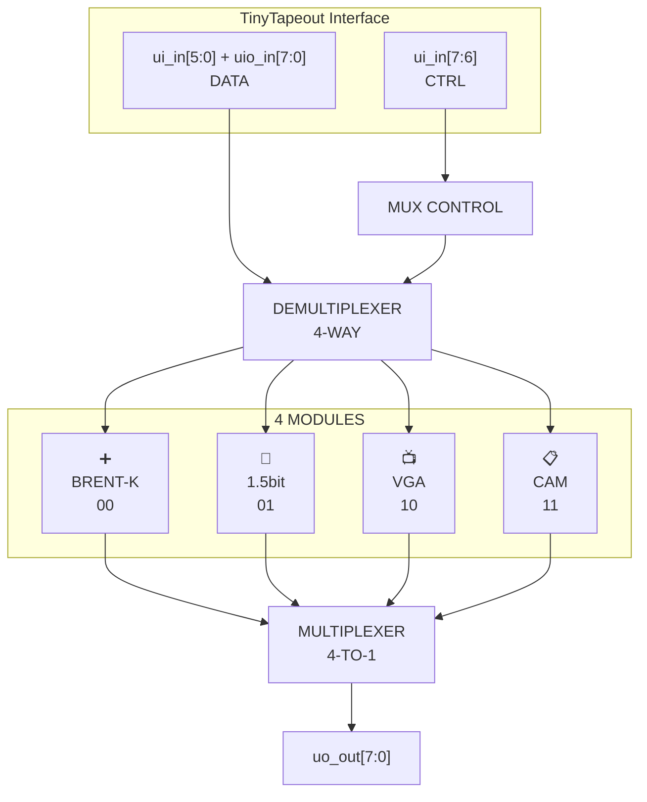
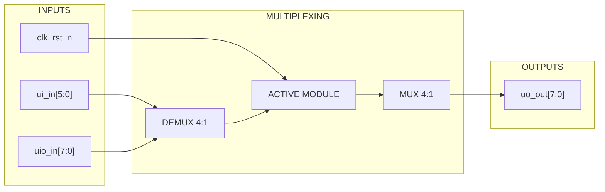

   

# 🔀 Multiplexed Digital Processing Unit

> **A multiplexed digital system with 4 specialized processing units**

🇫🇷 [Version française](README_FR.md)



## 📋 Module Documentation

| Module | Description | Documentation |
|--------|-------------|---------------|
| 🔀 **TOP** | Main controller and multiplexing | [📖 top.md](docs/top.md) |
| ➕ **BRENT-KUNG** | Optimized parallel adder | [📖 brent-kung.md](docs/brent-kung.md) |
| 📺 **VGA** | Video signal generator | [📖 vga.md](docs/vga.md) |
| 🎵 **1HALF** | Sigma-delta audio latch | [📖 1half_latch.md](docs/1half_latch.md) |
| 📋 **CAM** | Content-addressable memory | [📖 cam.md](docs/cam.md) |

## 🎛️ Multiplexing Usage

### Module Selection
```
ui_in[7:6] = CTRL[1:0]
┌─────┬─────────────┬─────────────────────┐
│CTRL │   MODULE    │     FUNCTION        │
├─────┼─────────────┼─────────────────────┤
│ 00  │ ➕ BRENT-K  │ Adder               │
│ 01  │ 🎵 1HALF    │ Audio latch         │
│ 10  │ 📺 VGA      │ Video generator     │
│ 11  │ 📋 CAM      │ Associative memory  │
└─────┴─────────────┴─────────────────────┘
```

### Data Routing


## 🔌 Pin Usage

- **`ui_in[7:6]`** : Module selection  
  (00=BRENT, 01=1HALF, 10=VGA, 11=CAM)
- **`ui_in[5:0]` + `uio_in[7:0]`** : Data inputs  
  (14 bits available for modules)
- **`uo_out[7:0]`** : Results from active module

See individual module documentation for specific pin assignments.


## 🏗️ Project Architecture

```
📁 src/
├── 🔧 config.json      # TinyTapeout configuration
├── 🔀 top.v           # Main module + MUX/DEMUX
├── 🔄 mux.v           # Multiplexing utilities
├── ➕ brent-kung.v    # Brent-Kung adder
├── 🎵 1half_latch.v   # Sigma-delta 1.5bit latch
├── 📺 vga.v           # VGA generator + H/V sync
└── 📋 cam.v           # Content-Addressable Memory

📁 docs/
├── 📖 top.md          # Main module documentation
├── 📖 brent-kung.md   # Adder documentation
├── 📖 vga.md          # VGA documentation
├── 📖 1half_latch.md  # Audio latch documentation
└── 📖 cam.md          # CAM memory documentation
```

## 🎯 Applications

- **🎵 Audio** : Class D amplifier with sigma-delta modulator
- **📺 Video** : VGA pattern generator for testing and display  
- **🧮 Computing** : Fast arithmetic for signal processing
- **💾 Memory** : Associative cache and lookup tables

