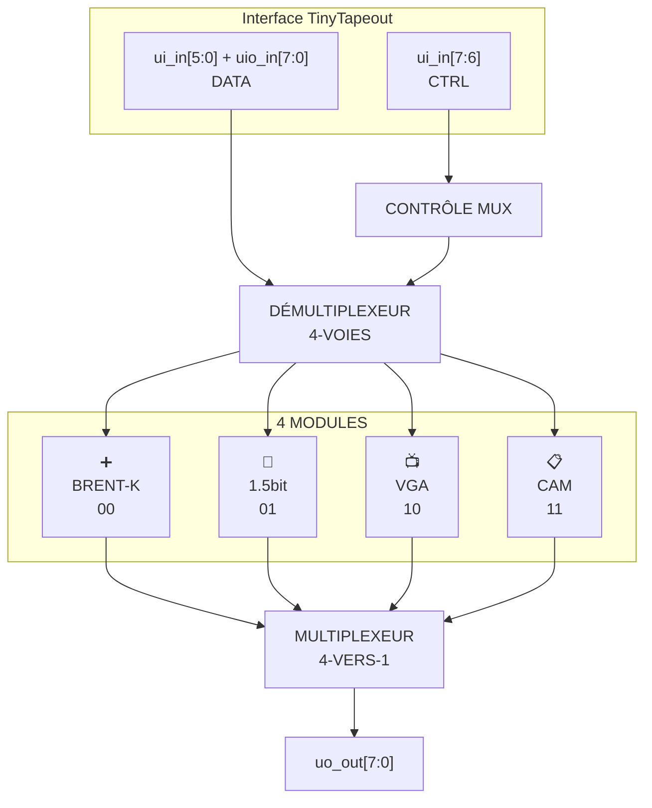
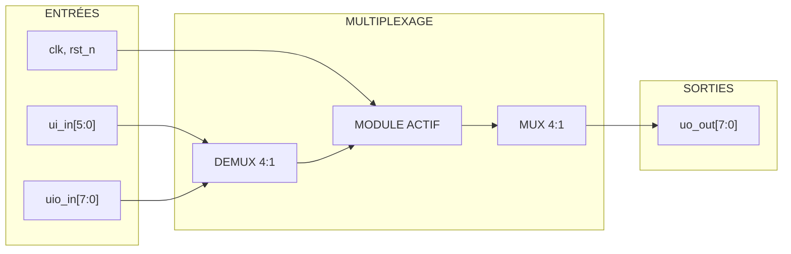

   

# 🔀 Unité de Traitement Numérique Multiplexée

> **Un système numérique multiplexé avec 4 unités de traitement spécialisées**

🇺🇸 [English version](README.md)



## 📋 Documentation des Modules

| Module | Description | Documentation |
|--------|-------------|---------------|
| 🔀 **TOP** | Contrôleur principal et multiplexage | [📖 top_FR.md](docs/top_FR.md) |
| ➕ **BRENT-KUNG** | Additionneur parallèle optimisé | [📖 brent-kung_FR.md](docs/brent-kung_FR.md) |
| 📺 **VGA** | Générateur de signaux vidéo | [📖 vga_FR.md](docs/vga_FR.md) |
| 🎵 **1HALF** | Latch sigma-delta audio | [📖 1half_latch_FR.md](docs/1half_latch_FR.md) |
| 📋 **CAM** | Mémoire associative | [📖 cam_FR.md](docs/cam_FR.md) |

## 🎛️ Utilisation du Multiplexage

### Sélection des Modules
```
ui_in[7:6] = CTRL[1:0]
┌─────┬─────────────┬─────────────────────┐
│CTRL │   MODULE    │     FONCTION        │
├─────┼─────────────┼─────────────────────┤
│ 00  │ ➕ BRENT-K  │ Additionneur        │
│ 01  │ 🎵 1HALF    │ Latch audio         │
│ 10  │ 📺 VGA      │ Générateur vidéo    │
│ 11  │ 📋 CAM      │ Mémoire associative │
└─────┴─────────────┴─────────────────────┘
```

### Routage des Données


## 🔌 Utilisation des Broches

- **`ui_in[7:6]`** : Sélection de module  
  (00=BRENT, 01=1HALF, 10=VGA, 11=CAM)
- **`ui_in[5:0]` + `uio_in[7:0]`** : Données d'entrée  
  (14 bits disponibles pour les modules)
- **`uo_out[7:0]`** : Résultats du module actif

Voir la documentation de chaque module pour les assignations spécifiques.

## 📊 Spécifications

```
┌─────────────────┬─────────────────────────┐
│ FRÉQUENCE       │ 66 MHz                  │
│ ENTRÉES DONNÉES │ 14 bits disponibles     │
│ CONTRÔLE        │ 2 bits (multiplexage)   │
│ SORTIES         │ 8 bits                  │
│ MODULES         │ 4 unités spécialisées  │
└─────────────────┴─────────────────────────┘
```

## 🏗️ Architecture du Projet

```
📁 src/
├── 🔧 config.json      # Configuration TinyTapeout
├── 🔀 top.v           # Module principal + MUX/DEMUX
├── 🔄 mux.v           # Utilitaires de multiplexage
├── ➕ brent-kung.v    # Additionneur Brent-Kung
├── 🎵 1half_latch.v   # Latch sigma-delta 1.5bit
├── 📺 vga.v           # Générateur VGA + sync H/V
└── 📋 cam.v           # Mémoire Content-Addressable

📁 docs/
├── 📖 top_FR.md       # Documentation module principal
├── 📖 brent-kung_FR.md# Documentation additionneur
├── 📖 vga_FR.md       # Documentation VGA
├── 📖 1half_latch_FR.md# Documentation latch audio
└── 📖 cam_FR.md       # Documentation mémoire CAM
```

## 🎯 Applications

- **🎵 Audio** : Amplificateur classe D avec modulateur sigma-delta
- **📺 Vidéo** : Générateur de patterns VGA pour tests et affichage
- **🧮 Calcul** : Arithmétique rapide pour traitement du signal  
- **💾 Mémoire** : Cache associatif et tables de lookup

