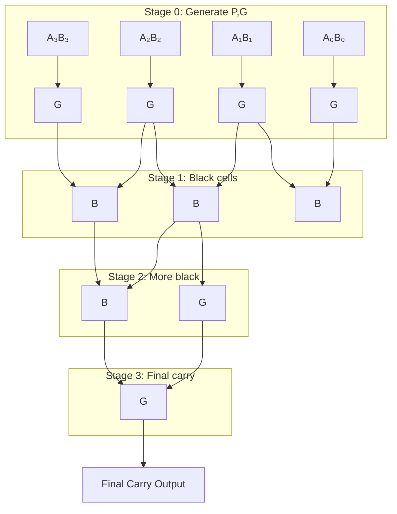

[🏠 Back to Main](../README.md)

# ➕ BRENT-KUNG - Fast 4-bit Adder

> **Ultra-fast parallel adder • 3x faster than ripple carry**

🇫🇷 [Version française](brent-kung_FR.md)

## 🎯 What it does
Adds two 4-bit numbers + carry = 5-bit result in just 3 gate delays!

## 🔌 Pin Connections

### Selection: Set `ui_in[7:6] = 00`

```
┌─────────────────┬─────────┬─────────────────────┐
│      PIN        │   DIR   │      FUNCTION       │
├─────────────────┼─────────┼─────────────────────┤
│ ui_in[3:0]     │   IN    │ 🅰️ Number A (4-bit) │
│ uio_in[3:0]    │   IN    │ 🅱️ Number B (4-bit) │
│ uio_in[7]      │   IN    │ ➕ Carry In         │
│ uo_out[4:0]    │   OUT   │ 📊 Sum (5-bit)      │
│ uo_out[7:5]    │   OUT   │ 🚫 Always 000       │
└─────────────────┴─────────┴─────────────────────┘
```

## 📊 Examples

### Simple Addition
```
🅰️ = 1010 (10)  →  ui_in[3:0]  = 1010
🅱️ = 0110 (6)   →  uio_in[3:0] = 0110  
➕ = 0         →  uio_in[7]   = 0
                 uo_out[4:0] = 10000 (16)
```

### With Carry
```
🅰️ = 1111 (15) →  ui_in[3:0]  = 1111
🅱️ = 0001 (1)  →  uio_in[3:0] = 0001
➕ = 1         →  uio_in[7]   = 1
                 uo_out[4:0] = 10001 (17)
```

## ⚡ Performance

```
┌──────────────┬─────────────┬─────────────┐
│    METRIC    │ RIPPLE CARRY│ BRENT-KUNG  │
├──────────────┼─────────────┼─────────────┤
│ 🕐 Speed     │ 4 delays    │ 3 delays    │
│ 📐 Size      │ Small       │ Medium      │
│ 🔋 Power     │ Low         │ Medium      │
│ 🎯 Best for  │ Area        │ Speed       │
└──────────────┴─────────────┴─────────────┘
```

## 🏗️ How it Works



**G** = Generate, **B** = Black (combine)


## 📂 Source
- File: `src/brent-kung.v:38-85`
- Self-contained (no dependencies)

---
[🏠 Back to Main](../README.md)