# ➕ BRENT-KUNG - Additionneur 4-bit

> **Additionneur parallèle ultra-rapide**

🇺🇸 [English version](brent-kung.md)

## 🔌 Connexions

### Sélection: `ui_in[7:6] = 00`

```
┌─────────────────┬─────────┬─────────────────────┐
│      PIN        │   DIR   │      FONCTION       │
├─────────────────┼─────────┼─────────────────────┤
│ ui_in[3:0]     │   IN    │ 🅰️ Nombre A (4-bit) │
│ uio_in[3:0]    │   IN    │ 🅱️ Nombre B (4-bit) │
│ uio_in[7]      │   IN    │ ➕ Retenue entrée   │
│ uo_out[4:0]    │   OUT   │ 📊 Somme (5-bit)    │
│ uo_out[7:5]    │   OUT   │ 🚫 Toujours 000     │
└─────────────────┴─────────┴─────────────────────┘
```

## 📊 Exemples

### Addition simple
```
🅰️ = 1010 (10)  →  ui_in[3:0]  = 1010
🅱️ = 0110 (6)   →  uio_in[3:0] = 0110  
➕ = 0         →  uio_in[7]   = 0
                 uo_out[4:0] = 10000 (16)
```

### Avec retenue
```
🅰️ = 1111 (15) →  ui_in[3:0]  = 1111
🅱️ = 0001 (1)  →  uio_in[3:0] = 0001
➕ = 1         →  uio_in[7]   = 1
                 uo_out[4:0] = 10001 (17)
```

## ⚡ Performance

```
┌──────────────┬─────────────┬─────────────┐
│   MÉTRIQUE   │ RIPPLE CARRY│ BRENT-KUNG  │
├──────────────┼─────────────┼─────────────┤
│ 🕐 Vitesse   │ 4 délais    │ 3 délais    │
│ 📐 Taille    │ Petit       │ Moyen       │
│ 🔋 Conso     │ Faible      │ Moyenne     │
└──────────────┴─────────────┴─────────────┘
```

## 🏗️ Fonctionnement

```mermaid
flowchart TD
    subgraph Stage0 ["Étape 0: Génération P,G"]
        A3B3["A₃B₃"] --> G3["G"]
        A2B2["A₂B₂"] --> G2["G"]
        A1B1["A₁B₁"] --> G1["G"]
        A0B0["A₀B₀"] --> G0["G"]
    end
    
    subgraph Stage1 ["Étape 1: Cellules noires"]
        G3 --> B31["B"]
        G2 --> B31
        G2 --> B21["B"]
        G1 --> B21
        G1 --> B10["B"]
        G0 --> B10
    end
    
    subgraph Stage2 ["Étape 2: Plus de noires"]
        B31 --> B32["B"]
        B21 --> B32
        B21 --> G2S2["G"]
    end
    
    subgraph Stage3 ["Étape 3: Retenue finale"]
        B32 --> GFINAL["G"]
        G2S2 --> GFINAL
    end
    
    GFINAL --> CARRY["Sortie Retenue Finale"]
```



**G** = Génération, **B** = Noire (combinaison)


## 📂 Source
- Fichier: `src/brent-kung.v:38-85`