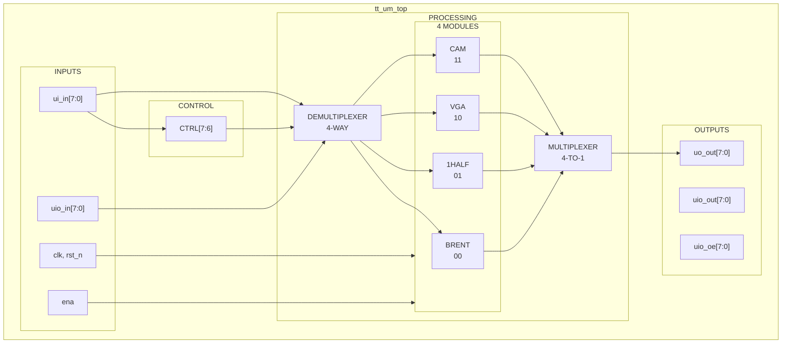

[🏠 Back to Main](../README.md)

# 🔀 TOP Module - Main Controller

> **Main module implementing multiplexed access to 4 specialized processing units**

🇫🇷 [Version française](top_FR.md)

## Overview

The `tt_um_top` module serves as the main entry point and implements a multiplexing system to access different sub-modules through a single set of inputs/outputs.

## Block Diagram



## Pin Description

### Inputs
- **`ui_in[7:0]`** : Dedicated input pins
  - `ui_in[7:6]` : Control bits (module selection)
  - `ui_in[5:0]` : Data input (routed to selected module)
- **`uio_in[7:0]`** : Bidirectional input pins (used as input)
- **`clk`** : System clock (66MHz max)
- **`rst_n`** : Active-low reset
- **`ena`** : Enable signal (always 1, can be ignored)

### Outputs
- **`uo_out[7:0]`** : Dedicated output pins (result from selected module)
- **`uio_out[7:0]`** : Bidirectional output pins (tied to 0)
- **`uio_oe[7:0]`** : Output enable for bidirectional pins (tied to 0)

## Control Logic

### Module Selection

The control logic uses a 2-bit selector to choose between 4 modules:

```verilog
wire [1:0] ctrl = ui_in[7:6];
```

| CTRL[1:0] | Module | Function |
|-----------|--------|----------|
| `2'b00` | CAM | Content-Addressable Memory |
| `2'b01` | VGA | Video Graphics Array |
| `2'b10` | 1HALF | 1.5-bit Sigma-Delta Latch |
| `2'b11` | BRENT | Brent-Kung Adder |

### Data Routing

Input data is distributed to modules via demultiplexers:

```verilog
// Input demultiplexing
wire [5:0] i_demux_1 = ui_in[5:0];
wire [5:0] i_demux_2 = uio_in[5:0];

// 4-way demultiplexers
demux #(.WAY(4), .WIRE(6)) input_one (i_demux_1, ctrl, demux_output_1);
demux #(.WAY(4), .WIRE(6)) input_two (i_demux_2, ctrl, demux_output_2);
```

Output selection via multiplexer:

```verilog
// Output multiplexing
wire [31:0] i_mux = {output_cam, output_vga, o_oh, o_brent};
mux #(.WAY(4), .WIRE(8)) output_one (i_mux, ctrl, uo_out);
```

## Module Instantiations

### CAM (Content-Addressable Memory)
```verilog
cam cam_inst(
    .output_addr(output_addr),
    .found(found),
    .clk(clk),
    .ena(ena),
    .rst_n(rst_n),
    .write(cam_write),
    .addr(cam_addr),
    .data(cam_data)
);
```

### VGA (Video Generator)
```verilog
vga_example vga_inst(
    .uo_out(output_vga),
    .clk(clk),
    .rst_n(rst_n)
);
```

### 1HALF (Sigma-Delta Latch)
```verilog
onehalf_latch latch_inst[3:0](
    .clk(clk),
    .in_p(i_oh_p[3:0]),
    .in_n(i_oh_n[3:0]),
    .out_p(o_oh[7:6:2]),
    .out_n(o_oh[6:4:2])
);
```

### BRENT (Brent-Kung Adder)
```verilog
brent_kung_cin brent_inst(
    .output_S(o_brent),
    .input_A(i_brent_A),
    .input_B(i_brent_B),
    .Cin(i_brent_Cin)
);
```

## Implementation Details

### Resource Usage
- **Logic Gates**: ~200 standard cells
- **Memory**: 16x8 bit RAM (CAM module)
- **Clock Frequency**: Up to 66MHz
- **Power**: Optimized for low power consumption

### Architecture
- Clock period: 15ns (66MHz)
- Critical path: Through multiplexer logic

## Usage

To use a specific module:
1. Set `ui_in[7:6]` according to desired module
2. Refer to individual module documentation for pin connections
3. Read result from `uo_out[7:0]`

## File Location
- **Source**: `src/top.v:8-115`
- **Dependencies**: `mux.v`, `cam.v`, `vga.v`, `1half_latch.v`, `brent-kung.v`

## Testing
- Testbench validates multiplexer switching
- Each module tested individually and in combination

---
[🏠 Back to Main](../README.md)