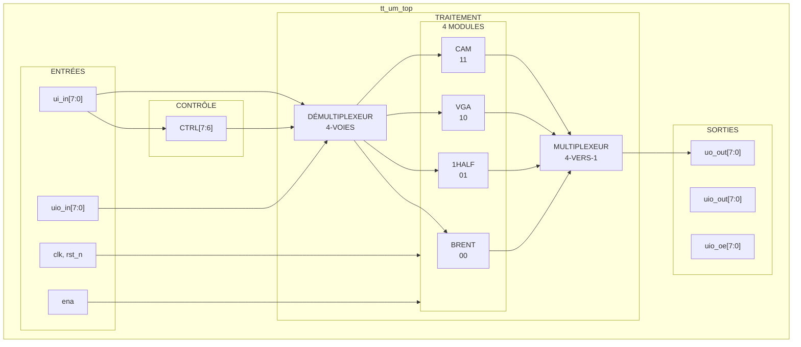

# 🔀 Module TOP - Contrôleur Principal

> **Module principal implémentant l'accès multiplexé à 4 unités de traitement spécialisées**

🇺🇸 [English version](top.md)

## Vue d'ensemble

Le module `tt_um_top` sert de point d'entrée principal et implémente un système de multiplexage pour accéder aux différents sous-modules via un même jeu d'entrées/sorties.

## Diagramme de Blocs



## Description des Broches

### Entrées
- **`ui_in[7:0]`** : Broches d'entrée dédiées
  - `ui_in[7:6]` : Bits de contrôle (sélection du module)
  - `ui_in[5:0]` : Données d'entrée (routées vers le module sélectionné)
- **`uio_in[7:0]`** : Broches bidirectionnelles (utilisées en entrée)
- **`clk`** : Horloge système (66MHz max)
- **`rst_n`** : Reset actif bas
- **`ena`** : Signal d'activation (toujours à 1, peut être ignoré)

### Sorties
- **`uo_out[7:0]`** : Broches de sortie dédiées (résultat du module sélectionné)
- **`uio_out[7:0]`** : Broches bidirectionnelles en sortie (fixées à 0)
- **`uio_oe[7:0]`** : Activation des sorties bidirectionnelles (fixées à 0)

## Logique de Contrôle

### Sélection des Modules

La logique de contrôle utilise un sélecteur 2-bit pour choisir entre 4 modules :

```verilog
wire [1:0] ctrl = ui_in[7:6];
```

| CTRL[1:0] | Module | Fonction |
|-----------|--------|----------|
| `2'b00` | CAM | Mémoire Associative |
| `2'b01` | VGA | Générateur Vidéo |
| `2'b10` | 1HALF | Latch Sigma-Delta 1.5-bit |
| `2'b11` | BRENT | Additionneur Brent-Kung |

### Routage des Données

Les données d'entrée sont distribuées aux modules via des démultiplexeurs :

```verilog
// Démultiplexage des entrées
wire [5:0] i_demux_1 = ui_in[5:0];
wire [5:0] i_demux_2 = uio_in[5:0];

// Démultiplexeurs 4-voies
demux #(.WAY(4), .WIRE(6)) input_one (i_demux_1, ctrl, demux_output_1);
demux #(.WAY(4), .WIRE(6)) input_two (i_demux_2, ctrl, demux_output_2);
```

Sélection de sortie via multiplexeur :

```verilog
// Multiplexage des sorties
wire [31:0] i_mux = {output_cam, output_vga, o_oh, o_brent};
mux #(.WAY(4), .WIRE(8)) output_one (i_mux, ctrl, uo_out);
```

## Instanciations des Modules

### CAM (Mémoire Associative)
```verilog
cam cam_inst(
    .output_addr(output_addr),
    .found(found),
    .clk(clk),
    .ena(ena),
    .rst_n(rst_n),
    .write(cam_write),
    .addr(cam_addr),
    .data(cam_data)
);
```

### VGA (Générateur Vidéo)
```verilog
vga_example vga_inst(
    .uo_out(output_vga),
    .clk(clk),
    .rst_n(rst_n)
);
```

### 1HALF (Latch Sigma-Delta)
```verilog
onehalf_latch latch_inst[3:0](
    .clk(clk),
    .in_p(i_oh_p[3:0]),
    .in_n(i_oh_n[3:0]),
    .out_p(o_oh[7:6:2]),
    .out_n(o_oh[6:4:2])
);
```

### BRENT (Additionneur Brent-Kung)
```verilog
brent_kung_cin brent_inst(
    .output_S(o_brent),
    .input_A(i_brent_A),
    .input_B(i_brent_B),
    .Cin(i_brent_Cin)
);
```

## Détails d'Implémentation

### Utilisation des Ressources
- **Portes Logiques** : ~200 cellules standard
- **Mémoire** : 16x8 bit RAM (module CAM)
- **Fréquence d'Horloge** : Jusqu'à 66MHz
- **Consommation** : Optimisée pour faible consommation

### Architecture
- Période d'horloge : 15ns (66MHz)
- Chemin critique : À travers la logique du multiplexeur

## Utilisation

Pour utiliser un module spécifique :
1. Configurer `ui_in[7:6]` selon le module désiré
2. Consulter la documentation du module pour les connexions de broches
3. Lire le résultat sur `uo_out[7:0]`

## Emplacement du Fichier
- **Source** : `src/top.v:8-115`
- **Dépendances** : `mux.v`, `cam.v`, `vga.v`, `1half_latch.v`, `brent-kung.v`

## Tests
- Testbench valide la commutation du multiplexeur
- Chaque module testé individuellement et en combinaison