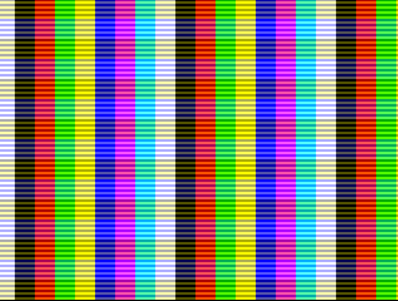

# 📺 VGA - Générateur de Signal Vidéo

> **VGA 640x480 avec pattern animé - génère des signaux vidéo analogiques classiques**

🇺🇸 [English version](vga.md)

## 🎯 Qu'est-ce que le VGA ?

VGA (Video Graphics Array) est un standard vidéo analogique qui utilise des signaux  
de synchronisation séparés pour indiquer aux moniteurs quand commencer une nouvelle  
ligne (HSYNC) et une nouvelle trame (VSYNC). Cette implémentation génère un signal  
640x480 @ 60Hz avec des patterns colorés animés.

## 🔌 Broches

### Sélection: `ui_in[7:6] = 10`

```
┌─────────────────┬─────────┬─────────────────────┐
│     BROCHE      │   DIR   │      FONCTION       │
├─────────────────┼─────────┼─────────────────────┤
│ uo_out[7]      │   OUT   │ HSYNC               │
│ uo_out[6]      │   OUT   │ BLUE[1]             │
│ uo_out[5]      │   OUT   │ GREEN[1]            │
│ uo_out[4]      │   OUT   │ RED[1]              │
│ uo_out[3]      │   OUT   │ VSYNC               │
│ uo_out[2]      │   OUT   │ BLUE[0]             │
│ uo_out[1]      │   OUT   │ GREEN[0]            │
│ uo_out[0]      │   OUT   │ RED[0]              │
└─────────────────┴─────────┴─────────────────────┘
```

## 🖼️ Temporisation VGA



### Génération des Signaux
- **HSYNC**: Sync horizontale (signal début de ligne)
- **VSYNC**: Sync verticale (signal début de trame)
- **RGB**: 2-bit par couleur (4 niveaux × 3 = 64 couleurs total)

### Paramètres de Temporisation
```
Horizontal: 640 pixels + 16 front + 96 sync + 48 back = 800 total
Vertical:   480 lignes + 10 front + 2 sync  + 33 back = 525 total
Fréquence:  25.175 MHz horloge pixel → 60Hz rafraîchissement
```

## 🎨 Génération du Pattern

**Barres Colorées Mobiles:**
- Barres horizontales qui se décalent vers la droite à chaque trame
- Couleurs basées sur position pixel et compteur de trame
- Pattern: `moving_x = pix_x + compteur_trame`

**Logique Couleur:**
```
R = {moving_x[5], pix_y[2]}  // Rouge varie horizontalement + verticalement
G = {moving_x[6], pix_y[2]}  // Vert pattern horizontal différent
B = {moving_x[7], pix_y[5]}  // Bleu plus lent horizontal + vertical
```

## 📱 Sortie

- **Résolution**: 640x480 @ 60Hz
- **Couleurs**: RGB 2-bit (64 couleurs)
- **Pattern**: Barres horizontales animées
- **Autonome**: Aucune entrée requise

## 📂 Source
- Fichier: `src/vga.v:8-126`